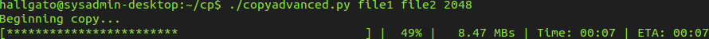

# Copy advanced
The default cp command with some human-friendly features.

### Usage
        copyadvanced.py <sourcefile> <destinationfile> [blocksize]

### Blocksize
The size of the block. Reads *blocksize* byte(s) data from source file, and writes to destination file. 
**Warning!** *blocksize* should be less than the available memory. Default is 32768.

### Features
* progressbar
* percentage
* speed
* elapsed time
* ETA

### Screenshot

### Test

#### Testing environment
* File size: 536.870.912 bytes
* Computer
  * Kernel: Linux 3.13.0-34-generic x86_64
  * CPU: Intel(R) Core(TM) i3-2100 CPU @ 3.10GHz
  * RAM: 4 GB

#### Results
Blocksize | Time | Speed
--------- | ---- | -----
512 B | 04:11 | ~2MB/s
1024 B | 02:05 | ~4MB/s
4096 B | 00:31 | ~16MB/s
8192 B | 00:15 | ~32MB/s
32768 B | 00:03 | ~120MB/s

### Contributions
Your contributions are always welcome!
